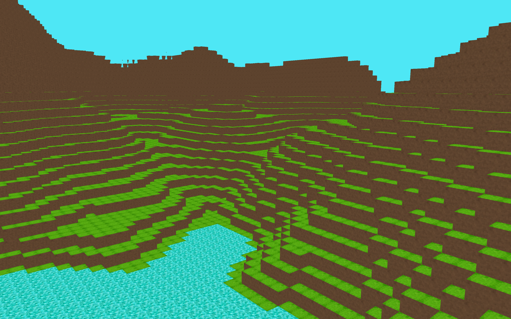

import { Card, CardGrid } from '@astrojs/starlight/components';

<Card title="Repository" icon="github">
    <a href="https://github.com/JakeButf/opengl-c-renderer">Click to view the repository on GitHub.</a>
</Card>



The OpenGL C renderer is one of my projects that I am most proud of. 

A common trend among developers on YouTube is recreating the video game Minecraft in various different methods. This inspired me to give it a try with my own twist: to write it from complete scratch in 100% C (most engines using OpenGL are written in C++) with OpenGL.

While I have worked in C and C++ in the past, I chose C not only just for the challenge, but also to help build skills in memory management and overall project management without the conveniences of an object oriented language.

## How It Works

While the rendering loop follows standard OpenGL practices (referenced from Learn OpenGL - Graphics Programming), several elements work together to make this happen:

```
float lastFrame = 0.0f;
    while(!glfwWindowShouldClose(w->skeleton->window))
    {
        glClearColor(SKYBOX_COLOR_R / 255.0f, SKYBOX_COLOR_G / 255.0f, SKYBOX_COLOR_B / 255.0f, SKYBOX_COLOR_A / 255.0f);
        glClear(GL_COLOR_BUFFER_BIT | GL_DEPTH_BUFFER_BIT);

        float currentFrame = glfwGetTime();
        float deltaTime = currentFrame - lastFrame;
        lastFrame = currentFrame;
        processInput(w->skeleton->window, deltaTime);
        //Render Commands
        mat4 viewMatrix;
        GetViewMatrix(camera, viewMatrix);

        //CalculateFrameRate();

        unsigned int viewLoc = glGetUniformLocation(shader_program, "view");
        glUniformMatrix4fv(viewLoc, 1, GL_FALSE, viewMatrix[0]);

        unsigned int projLoc = glGetUniformLocation(shader_program, "projection");
        glUniformMatrix4fv(projLoc, 1, GL_FALSE, globalProjectionMatrix);
        
        float green = sin(deltaTime) / 2.0f + 0.5f;
        int vertexColorLocation = glGetUniformLocation(shader_program, "vertexColor");
        glUniform4f(vertexColorLocation, 0.0f, green, 0.0f, 1.0f);
        //Draw Code Here
        DrawWorld(world, shader_program, textureAtlas);
        //

        glfwSwapBuffers(w->skeleton->window);
        glfwPollEvents();
    }
```

However, the more interesting aspect of this project is the voxel renderer. The general concept is designed like so:

The game generates a world made of chunks -> chunks are generated made of cubes -> cubes are generated with hardcoded vertices and indices

Lets take a look at cube.c:

```
float cubeVerts[] = 
{
    // Front Face
    -0.5f, -0.5f, -0.5f, 1.0f, 0.0f,
    0.5f, -0.5f, -0.5f, 0.0f, 1.0f,
    0.5f, 0.5f, -0.5f, 1.0f, 0.0f,
    -0.5f, 0.5f, -0.5f, 0.0f, 1.0f,

    // Back Face
    -0.5f, -0.5f, 0.5f, 1.0f, 0.0f,
    0.5f, -0.5f, 0.5f, 0.0f, 1.0f,
    0.5f, 0.5f, 0.5f, 1.0f, 0.0f,
    -0.5f, 0.5f, 0.5f, 0.0f, 1.0f,
};

unsigned int cubeIndices[] = 
{
    // Front face
    0, 1, 2,
    2, 3, 0,

    // Back face
    4, 5, 6,
    6, 7, 4,

    // Left face
    0, 3, 7,
    7, 4, 0,

    // Right face
    1, 2, 6,
    6, 5, 1,

    // Bottom face
    0, 1, 5,
    5, 4, 0,

    // Top face
    2, 3, 7,
    7, 6, 2,
};
```

The chunk then places these cubes based on perlin noise to give the illusion of mountains and lakes that are completely random, allowing for infinite possibilities when generating a world. Each chunk also has a random chance of being a type of "biome" that has it's own unique textures. chunk.c is very long, but here is the CreateChunkMesh(), which implements face culling by only rendering faces adjacent to air:

```
void CreateChunkMesh(Chunk* chunk)
{
    for (int x = 0; x < CHUNK_SIZE; x++)
    {
        for (int y = 0; y < CHUNK_HEIGHT; y++)
        {
            for (int z = 0; z < CHUNK_SIZE; z++)
            {
                BlockType currentBlock = chunk->blocks[x][y][z].type;

                if (currentBlock != AIR)
                {
                    if (x == CHUNK_SIZE - 1 || chunk->blocks[x + 1][y][z].type == AIR)
                        AddFace(chunk, x, y, z, DIRECTION_X_POS);
                    if (x == 0 || chunk->blocks[x - 1][y][z].type == AIR)
                        AddFace(chunk, x, y, z, DIRECTION_X_NEG);
                    if (y == CHUNK_HEIGHT - 1 || chunk->blocks[x][y + 1][z].type == AIR)
                        AddFace(chunk, x, y, z, DIRECTION_Y_POS);
                    if (y == 0 || chunk->blocks[x][y - 1][z].type == AIR)
                        AddFace(chunk, x, y, z, DIRECTION_Y_NEG);
                    if (z == CHUNK_SIZE - 1 || chunk->blocks[x][y][z + 1].type == AIR)
                        AddFace(chunk, x, y, z, DIRECTION_Z_POS);
                    if (z == 0 || chunk->blocks[x][y][z - 1].type == AIR)
                        AddFace(chunk, x, y, z, DIRECTION_Z_NEG);
                }
            }
        }
    }
    glBindVertexArray(chunk->vao);
    glBindBuffer(GL_ARRAY_BUFFER, chunk->vbo);
    glBufferData(GL_ARRAY_BUFFER, chunk->verticeCount * sizeof(GLfloat), chunk->vertices, GL_STATIC_DRAW);
    glBindBuffer(GL_ELEMENT_ARRAY_BUFFER, chunk->ebo);
    glBufferData(GL_ELEMENT_ARRAY_BUFFER, chunk->indicesCount * sizeof(GLuint), chunk->indices, GL_STATIC_DRAW);

    glVertexAttribPointer(0, 3, GL_FLOAT, GL_FALSE, 5 * sizeof(float), (void*)0);
    glEnableVertexAttribArray(0);

    glVertexAttribPointer(1, 2, GL_FLOAT, GL_FALSE, 5 * sizeof(float), (void*)(3 * sizeof(float)));
    glEnableVertexAttribArray(1);

    glBindBuffer(GL_ARRAY_BUFFER, 0);
    glBindVertexArray(0);
}
```

These chunks are created in world.c, or more specifically in CreateWorld():

```
World* CreateWorld(int seed)
{
    World* world = malloc(sizeof(World));
    float* worldNoise = GenerateWorldNoise(seed);
    for(int x = 0; x < WORLD_SIZE; x++)
    {
        for(int z = 0; z < WORLD_SIZE; z++)
        {
            vec3 chunkLocation = {x * CHUNK_SIZE, 0, z * CHUNK_SIZE};
            float* noise = malloc(CHUNK_SIZE * CHUNK_SIZE * sizeof(float));
            for(int cz = 0; cz < CHUNK_SIZE; cz++)
            {
                for(int cx = 0; cx < CHUNK_SIZE; cx++)
                {
                    int worldIndex = ((z * CHUNK_SIZE + cz) * WORLD_SIZE * CHUNK_SIZE) + (x * CHUNK_SIZE + cx);
                    noise[cz * CHUNK_SIZE + cx] = worldNoise[worldIndex];
                }
            }
            CreateBiomes();
            world->chunks[x][z] = CreateChunk(chunkLocation, noise);
            free(noise);
        }
    }
    free(worldNoise);
    FreeBiomes();
    return world;
}
```
This world is then passed into the buffer loop to be drawn, as shown earlier.

While this is a relative simplified overview of how the voxel engine works, it was not without it's headaches.

## The Challenges

### View Matrix

While this was not my first attempt at creating a graphics engine, it was my first time doing it from scratch like this and my first time creating one in 3D. 

One of the biggest challenges of making a 3D rendering engine is actually just making it 3D. Something I had never really thought of before this project, but is obvious in retrospect, is that making 3D graphics appear on a 2D screen is a very mathematically involved process. 3D graphics are not as simple as setting a variable to true... shockingly. 

The heavy lifting in the illusion of 3D graphics is done by what is called the "View Matrix", which is a representation of a "camera" in a 3D space. 

The view matrix for this project is in input.c:

```
void UpdateCameraVectors(Camera* camera)
{
    vec3 front;
    front[0] = cos(glm_rad(camera->yaw)) * cos(glm_rad(camera->pitch));
    front[1] = sin(glm_rad(camera->pitch));
    front[2] = sin(glm_rad(camera->yaw)) * cos(glm_rad(camera->pitch));
    glm_normalize(front);
    glm_vec3_copy(front, camera->front);

    glm_cross(camera->front, camera->worldUp, camera->right);
    glm_normalize(camera->right);
    glm_cross(camera->right, camera->front, camera->up);
    glm_normalize(camera->up);
}

void GetViewMatrix(Camera camera, mat4 dest)
{
    vec3 center;
    glm_vec3_add(camera.position, camera.front, center);
    glm_lookat(camera.position, center, camera.up, dest);
}
```

The glm_lookat function constructs a view matrix that transforms world coordinates to camera space using:

- Camera position (eye)

- Target point (center = position + front)

- Up vector (up)

Euler angles (yaw/pitch) are converted to a directional vector using spherical coordinates

### Shared Noise

One glaring problem I had with world generation was the glaring seams between chunks. Due to my bottom-up approach of designing the world generation, I reached an issue when generating worlds where chunks would would have vastly different height noise, ruining the illusion of a connected world. At the time, every individual chunk generated it's own noise, so the solution was relatively simple: world noise.

Rather than generate noise per chunk, I changed it generate a larger noise for the entire world (based on height and width of chunk amounts) and have each chunk use a portion of that noise, giving the illusion of connected noise between chunk seams.

```
float GetCombinedNoise(fnl_state* noise, float x, float y)
{
    float totalNoise = 0;
    float amp = 0.5f;
    float frequency = 1.0f;
    float maxAmplitude = 0.0f;

    for(int i = 0; i < NOISE_OCTAVES; i++)
    {
        totalNoise += fnlGetNoise2D(noise, x * frequency, y * frequency) * amp;
        maxAmplitude += amp;

        amp *= PERSISTENCE;
        frequency *= 2;
    }

    return totalNoise / maxAmplitude;
}

float* GenerateWorldNoise(int seed)
{
    float* noiseData = malloc(WORLD_SIZE * CHUNK_SIZE * WORLD_SIZE * CHUNK_SIZE * sizeof(float));
    fnl_state noise = fnlCreateState();
    fnl_state lake_noise = fnlCreateState();

    noise.seed = seed;
    lake_noise.seed = seed + 1;

    noise.noise_type = FNL_NOISE_PERLIN;
    lake_noise.noise_type = FNL_NOISE_PERLIN;

    int index = 0;
    for(int y = 0; y < WORLD_SIZE * CHUNK_SIZE; y++)
    {
        for(int x = 0; x < WORLD_SIZE * CHUNK_SIZE; x++)
        {
            float combinedNoise = GetCombinedNoise(&noise, x, y);
            float lakeNoise = GenerateLakeNoise(&lakeNoise, x, y);

            if(lakeNoise < LAKE_THRESHOLD)
            {
                combinedNoise -= DEPTH_MOD * (LAKE_THRESHOLD - lakeNoise);
            }
            noiseData[index++] = combinedNoise;
        }
    }
    return noiseData;
}
```

## Conclusion


<iframe src="https://giphy.com/embed/S9vQ71uKjuPpcITQbl" width="480" height="374" frameBorder="0" class="giphy-embed" allowFullScreen></iframe>

This was by far one of the most challenging and enjoyable projects I have ever worked on. I learned a lot in regards to memory management, 3D transformation math, 3D graphics, OpenGL, performance optimization, and overall project management.