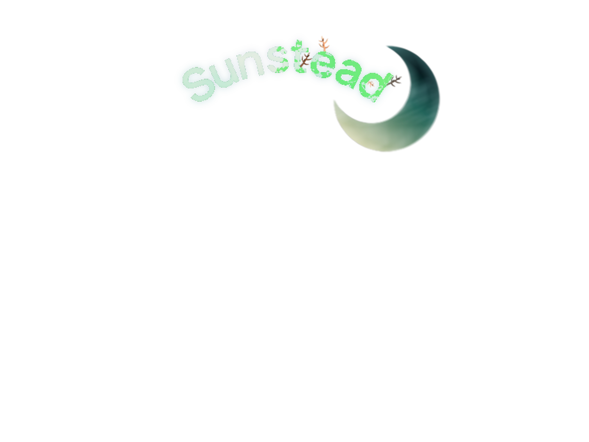

*Working Title*

Project Solstice is currently my main project. As of now, there is not much that will be shared publicly. 

Project Solstice as a concept technically was born in 2017. When I was in high-school I learned game development in JavaScript as a way to get into and teach myself programming. I did so through the creation of a Farm-Life Simulator game in [RPG Maker MV](https://www.rpgmakerweb.com/products/rpg-maker-mv) based on the Harvest Moon and Rune Factory games that I had played as a child. While the [RPG Maker MV](https://www.rpgmakerweb.com/products/rpg-maker-mv) game engine is notoriously "hand-holdy" a vast majority of the engines systems were rewritten through JavaScript plugins in order to accomidate the abnormal gameplay loop.

Some screenshots of this time still exist! 

|      |      |  |
| ------------- | ------------- | ------------- |
|  |  |  |

However, as I improved as a developer and continued to learn more about game development, I drifted away from RPG Maker MV and into other engines/frameworks. Recreating these core mechanics became a sort of "first goal" when learning something new. Due to this, basic versions of this game have existed in: [MonoGame](https://monogame.net/), [Godot](https://godotengine.org/), and [Unity](https://unity.com/).

After sitting on this project for half a decade, I decided it was about to time to bring it to reality. So, in 2022 I founded StudioHH with a few of my friends and development began. At this point in development, the majority of the game's design has undergone major changes and is not very similar to it's original concept.

Not much more can be said as of now, but feel free to check back soon for more details!