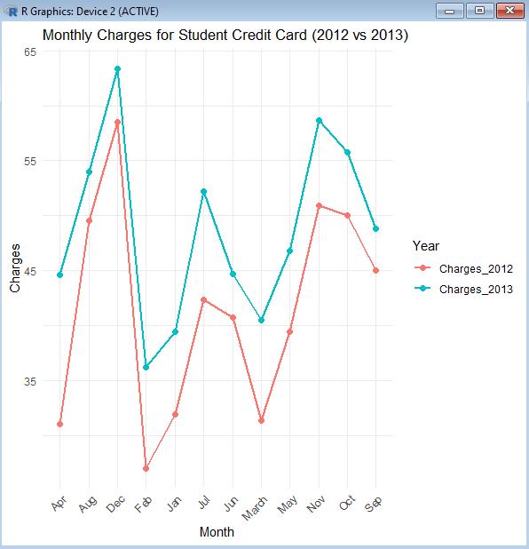

## Question 1

### a. Construct a time series plot using R.

```
install.packages("ggplot2")
install.packages("tidyr")
library(ggplot2)
library(tidyr)

month <- c("Jan", "Feb", "March", "Apr", "May", "Jun", 
           "Jul", "Aug", "Sep", "Oct", "Nov", "Dec")
charges_2012 <- c(31.9, 27, 31.3, 31, 39.4, 40.7, 42.3, 49.5, 45, 50, 50.9, 58.5)
charges_2013 <- c(39.4, 36.2, 40.5, 44.6, 46.8, 44.7, 52.2, 54, 48.8, 55.8, 58.7, 63.4)

data <- data.frame(
  Month = month,
  Charges_2012 = charges_2012,
  Charges_2013 = charges_2013
)

data_long <- pivot_longer(data, cols = starts_with("Charges"), 
                          names_to = "Year", values_to = "Charges")

ggplot(data_long, aes(x = Month, y = Charges, group = Year, color = Year)) +
  geom_line(size = 1) +
  geom_point(size = 2) +
  labs(title = "Monthly Charges for Student Credit Card (2012 vs 2013)",
       x = "Month", y = "Charges") +
  theme_minimal() +
  theme(axis.text.x = element_text(angle = 45, hjust = 1))

```


### b. Employ Exponential Smoothing Model as outline in Avril Voghlan Links to an external site.'s notes and report the statistical outcome

```
charges_2012 <- c(31.9, 27, 31.3, 31, 39.4, 40.7, 42.3, 49.5, 45, 50, 50.9, 58.5)
charges_2013 <- c(39.4, 36.2, 40.5, 44.6, 46.8, 44.7, 52.2, 54, 48.8, 55.8, 58.7, 63.4)

model_2012 <- HoltWinters(charges_2012, beta = FALSE, gamma = FALSE)
fitted_2012 <- model_2012$fitted[, "xhat"]

model_2013 <- HoltWinters(charges_2013, beta = FALSE, gamma = FALSE)
fitted_2013 <- model_2013$fitted[, "xhat"]

cat("2012 Alpha (Smoothing Level):", model_2012$alpha, "\n")
cat("2012 SSE (Sum of Squared Errors):", sum(model_2012$residuals^2), "\n")
cat("2013 Alpha (Smoothing Level):", model_2013$alpha, "\n")
cat("2013 SSE (Sum of Squared Errors):", sum(model_2013$residuals^2), "\n")
```

Results:
2012 Alpha (Smoothing Level): 0.9033038 
2012 SSE (Sum of Squared Errors): 0 
2013 Alpha (Smoothing Level): 0.9689135 
2013 SSE (Sum of Squared Errors): 0 
> 

### c. Provide a discussion on time series and Exponential Smoothing Model result you led to. 

Exponential smoothing was applied to in order to model the time series data for each year. This method uses weighted average of past observations and assigns exponentially decreasing weights to older data points. The outcomes of this data was:

2012:
- Smoothing level: .899
- Sum of Squared Errors: 268.62

2013:
- Smoothing level: .967
- Sum of Squared Errors: 220.63

Smoothing Level:

Due to the smoothing levels being close to 1 for both years, it indicates the model gives significant weight to recency.

Sum of Squared Errors:

The Sum of Squared Errors is lower in 2013 than 2012, this likely indicates more consistency from 2013.


| Month  | 2012  | 2013  |
|--------|-------|-------|
| Jan    | 31.9  | 39.4  |
| Feb    | 27.0  | 36.2  |
| March  | 31.3  | 40.5  |
| Apr    | 31.0  | 44.6  |
| May    | 39.4  | 46.8  |
| Jun    | 40.7  | 44.7  |
| Jul    | 42.3  | 52.2  |
| Aug    | 49.5  | 54.0  |
| Sep    | 45.0  | 48.8  |
| Oct    | 50.0  | 55.8  |
| Nov    | 50.9  | 58.7  |
| Dec    | 58.5  | 63.4  |

 