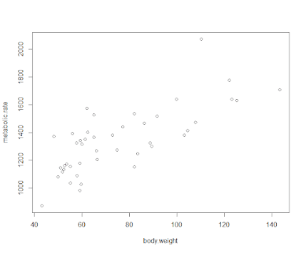

## Question  1
In this assignment's segment, we will use the following regression equation  Y = a + bX +e
Where:
Y is the value of the Dependent variable (Y), what is being predicted or explained

a or Alpha, a constant; equals the value of Y when the value of X=0

b or Beta, the coefficient of X; the slope of the regression line; how much Y changes for each one-unit change in X.

X is the value of the Independent variable (X), what is predicting or explaining the value of Y

e is the error term; the error in predicting the value of Y, given the value of X (it is not displayed in most regression equations).

The data in this assignment:
```
> x <- c(16, 17, 13, 18, 12, 14, 19, 11, 11, 10)
> y <- c(63, 81, 56, 91, 47, 57, 76, 72, 62, 48)
```

### 1.1 Define the relationship model between the predictor (X) and the response variable (Y):

This can be found using ```lm()``` in R.

```
x <- c(16, 17, 13, 18, 12, 14, 19, 11, 11, 10)
y <- c(63, 81, 56, 91, 47, 57, 76, 72, 62, 48)

model <- lm(y ~ x)
summary(model)
```

This results:

```
> x <- c(16, 17, 13, 18, 12, 14, 19, 11, 11, 10)
> y <- c(63, 81, 56, 91, 47, 57, 76, 72, 62, 48)
> 
> model <- lm(y ~ x)
> summary(model)

Call:
lm(formula = y ~ x)

Residuals:
    Min      1Q  Median      3Q     Max 
-11.435  -7.406  -4.608   6.681  16.834 

Coefficients:
            Estimate Std. Error t value Pr(>|t|)  
(Intercept)   19.206     15.691   1.224   0.2558  
x              3.269      1.088   3.006   0.0169 *
---
Signif. codes:  0 ‘***’ 0.001 ‘**’ 0.01 ‘*’ 0.05 ‘.’ 0.1 ‘ ’ 1

Residual standard error: 10.48 on 8 degrees of freedom
Multiple R-squared:  0.5303,    Adjusted R-squared:  0.4716 
F-statistic: 9.033 on 1 and 8 DF,  p-value: 0.01693
```

The regression model estimates the intercept to be approximately 19.206 and the slope to be approximately 3.269. This means that for every one-unit increase in xx, the value of yy is expected to increase by 3.269 units. The R-squared value of 0.5303 indicates that 53% of the variation in yy is explained by xx, and the p-value for the slope is significant, this suggests a meaningful relationship between the variables.

### 1.2 Calculate the coefficients? 

We can find this by adding this line:

```
coefficients(model)
```

Which results in:
Intercept = 19.206
Slope = 3.269

## Question 2.

The following question is posted by Chi Yau (Links to an external site.) the author of  R Tutorial With Bayesian Statistics Using Stan (Links to an external site.) and his blog posting regarding Regression analysis (Links to an external site.).
Problem -

Apply the simple linear regression model (see the above formula) for the data set called "visit" (see below), and estimate the the discharge duration if the waiting time since the last eruption has been 80 minutes.
> head(visit) 
  discharge  waiting 
1     3.600      79 
2     1.800      54 
3     3.333      74 
4     2.283      62 
5     4.533      85 
6     2.883      55 

Employ the following formula discharge ~ waiting and data=visit)

### 2.1 Define the relationship model between the predictor and the response variable.

The relationship between the predictor variable (waiting) and the response variable (discharge) can be described with this simple linear regression model:

```
discharge = a + b * waiting + e
```
### 2.2 Extract the parameters of the estimated regression equation with the coefficients function.

We can extract the intercept and slope using this R code:

```
model <- lm(discharge ~ waiting, data = visit)
coefficients(model)
```

The results are:
Intercept = -1.533
Slope = 0.068

### 2.3 Determine the fit of the eruption duration using the estimated regression equation.

We can predict the predicted discharge duration with this R code:

```
predicted_discharge <- predict(model, newdata = data.frame(waiting = 80))
predicted_discharge
```

This gives us a result of approximately 3.87.

## Question 3.  Multiple regression

We will use a very famous datasets in R called mtcars. This dateset was extracted from the 1974 Motor Trend US magazine, and comprises fuel consumption and 10 aspects of automobile design and performance for 32 automobiles (1973--74 models).

This data frame contain 32 observations on 11 (numeric) variables.
[, 1] 	mpg 	Miles/(US) gallon
[, 2] 	cyl 	Number of cylinders
[, 3] 	disp 	Displacement (cu.in.)
[, 4] 	hp 	Gross horsepower
[, 5] 	drat 	Rear axle ratio
[, 6] 	wt 	Weight (1000 lbs)
[, 7] 	qsec 	1/4 mile time
[, 8] 	vs 	Engine (0 = V-shaped, 1 = straight)
[, 9] 	am 	Transmission (0 = automatic, 1 = manual)
[,10] 	gear 	Number of forward gears

To call mtcars data in R
R comes with several built-in data sets, which are generally used as demo data for playing with R functions. One of those datasets build in R is mtcars.
In this question, we will use 4 of the variables found in mtcars by using the following function

input <- mtcars[,c("mpg","disp","hp","wt")]
print(head(input))

### 3.1 Examine the relationship Multi Regression Model as stated above and its Coefficients using 4 different variables from mtcars (mpg, disp, hp and wt).
Report on the result and explanation what does the multi regression model and coefficients tells about the data?   

input <- mtcars[,c("mpg","disp","hp","wt")]  

lm(formula = mpg ~ disp + hp + wt, data = input) 

This is the R code:

```
> lm(formula = mpg ~ disp + hp + wt, data = input) 

Call:
lm(formula = mpg ~ disp + hp + wt, data = input)

Coefficients:
(Intercept)         disp           hp           wt  
  37.105505    -0.000937    -0.031157    -3.800891  
```

This formula allows the mpg to change while having singular constants meaning that mpg is the response variable while the formula cycles through each of disp, hp, and wt for our predictor variables.

## Question 4. 

From our textbook pp. 110 Exercises # 5.1.

With the rmr data set, plot metabolic rate versus body weight. Fit a linear regression to the relation. According to the fitted model, what is the predicted metabolic rate for a body weight of 70 kg?

The data set rmr is R, make sure to install the book R package: ISwR. After installing the ISwR package, here is a simple illustration to the set of the problem.

library(ISwR)

plot(metabolic.rate~body.weight,data=rmr)

